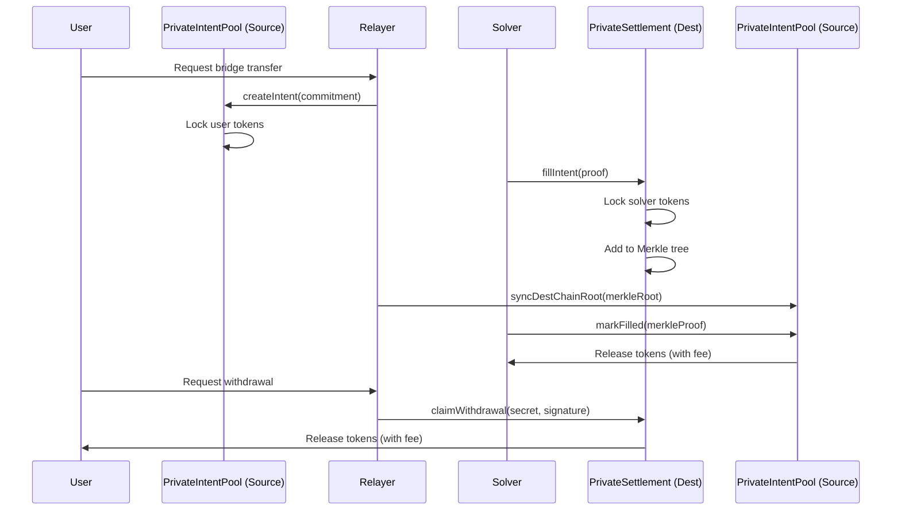

# 🌑 ShadowSwap Privacy Bridge

<div align="center">

**Privacy-preserving cross-chain bridge between Ethereum and Mantle**

[](https://soliditylang.org/)
[](https://www.rust-lang.org/)
[](LICENSE)

[Features](#-features) • [Architecture](#-architecture) • [Deployments](#-deployed-contracts) • [Usage](#-usage) • [Verification](#-contract-verification)

</div>

---

## 📖 Overview

ShadowSwap enables **private, bidirectional token transfers** between Ethereum and Mantle using zero-knowledge commitments and Merkle proofs. Users create privacy-preserving intents that are fulfilled by decentralized solvers, ensuring trustless cross-chain settlement without revealing identities or transaction details until withdrawal.

### Key Features

- 🔒 **Privacy-First**: Poseidon hash commitments hide transaction details
- 🌉 **Bidirectional**: Seamless transfers between Ethereum ↔ Mantle
- ⚡ **Fast Settlement**: 1-hour intent timeout with automatic refunds
- 💰 **Competitive Fees**: 0.2% total fee (0.1% intent + 0.1% settlement)
- 🔐 **Trustless**: Merkle proof verification, no central authority
- 🎯 **Solver Network**: Open market for intent fulfillment

---

## 🏗️ Architecture

### Core Components

#### 🎯 PrivateIntentPool
**Intent creation and fulfillment tracking**
- Users deposit tokens and create privacy commitments using `poseidon(secret, nullifier, amount, destChain)`
- Solvers fulfill intents after cross-chain Merkle proof verification
- 1-hour timeout with refund mechanism for expired intents
- Supports amounts: 0.001 ETH - 100 ETH

#### 💱 PrivateSettlement
**Cross-chain settlement and withdrawal**
- Solvers provide liquidity on destination chain
- Users withdraw by revealing secret and nullifier
- Nullifier registry prevents double-spending
- Signature-based claim authorization

#### 🔐 PoseidonHasher
**Zero-knowledge commitment generation**
- Creates privacy-preserving commitments
- Deployed once on Mantle (cheaper gas)
- Referenced by contracts on both chains

#### 🤖 Relay Coordinator
**Automated fulfillment service**
- Monitors events on both chains via Indexer
- Syncs Merkle roots for cross-chain verification
- Manages price feeds for multi-token support
- Facilitates decentralized solver competition

---

## 📍 Deployed Contracts

### Mantle Sepolia (Chain ID: 5003)

| Contract | Address | Explorer |
|----------|---------|----------|
| **PoseidonHasher** | `0x8EA86eD4317AF92f73E5700eB9b93A72dE62f3B1` | [View](https://explorer.sepolia.mantle.xyz/address/0x8EA86eD4317AF92f73E5700eB9b93A72dE62f3B1) |
| **PrivateIntentPool** | `0x3ecB330Aa3EaE12bbc26022dE9ee140C06e3da43` | [View](https://explorer.sepolia.mantle.xyz/address/0x3ecB330Aa3EaE12bbc26022dE9ee140C06e3da43) |
| **PrivateSettlement** | `0x67eEf23fc45e149E43944100be8658c55D48f1a1` | [View](https://explorer.sepolia.mantle.xyz/address/0x67eEf23fc45e149E43944100be8658c55D48f1a1) |

### Ethereum Sepolia (Chain ID: 11155111)

| Contract | Address | Explorer |
|----------|---------|----------|
| **PrivateIntentPool** | `0xA019C4fFC50b58AF6221F9EB59126630E26f3326` | [View](https://sepolia.etherscan.io/address/0xA019C4fFC50b58AF6221F9EB59126630E26f3326) |
| **PrivateSettlement** | `0x0d632dC7786CD01712ED3CF3c6fa7F9e9C67Fa49` | [View](https://sepolia.etherscan.io/address/0x0d632dC7786CD01712ED3CF3c6fa7F9e9C67Fa49) |

---

## 💎 Supported Tokens

### Ethereum
- **ETH** (Native)
- **WETH**: `0x50e8Da97BeEB8064714dE45ce1F250879f3bD5B5`
- **USDC**: `0x28650373758d75a8fF0B22587F111e47BAC34e21`
- **USDT**: `0x89F4f0e13997Ca27cEB963DEE291C607e4E59923`
- **MNT**: `0x65e37B558F64E2Be5768DB46DF22F93d85741A9E`

### Mantle
- **ETH** (Native)
- **WETH**: `0xdeaddeaddeaddeaddeaddeaddeaddeaddead1111`
- **USDC**: `0xA4b184006B59861f80521649b14E4E8A72499A23`
- **USDT**: `0xB0ee6EF7788E9122fc4AAE327Ed4FEf56c7da891`
- **MNT**: `0x44FCE297e4D6c5A50D28Fb26A58202e4D49a13E7`

---

## 💸 Fee Structure

| Fee Type | Rate | Description |
|----------|------|-------------|
| **Intent Fee** | 0.1% (10 bps) | Charged on PrivateIntentPool when solver claims |
| **Settlement Fee** | 0.1% (10 bps) | Charged on PrivateSettlement when user withdraws |
| **Total Fee** | 0.2% | Combined cross-chain transfer cost |

---

## 🚀 Usage

### For Users

#### 1. Create Intent (Source Chain)
```solidity
// Generate commitment off-chain
bytes32 commitment = poseidon(secret, nullifier, amount, destChain);

// Relayer creates intent on behalf of user
intentPool.createIntent(
    intentId,
    commitment,
    token,
    amount,
    destChain,
    refundAddress,
    secret,
    nullifier
);
```

#### 2. Wait for Solver Fulfillment
- Solvers monitor intents and provide liquidity on destination chain
- Solver calls `fillIntent()` on PrivateSettlement
- Intent marked as filled after Merkle proof verification

#### 3. Claim Withdrawal (Destination Chain)
```solidity
// User signs claim authorization
bytes memory claimAuth = sign(intentId, nullifier, recipient);

// Relayer submits claim
settlement.claimWithdrawal(
    intentId,
    nullifier,
    recipient,
    secret,
    claimAuth
);
```

### For Solvers

#### Monitor & Fill Intents
```rust
// Watch for IntentCreated events
let intents = intent_pool.query_filter(filter, None, None).await?;

// Fill on destination chain
settlement.fill_intent(
    intent_id,
    commitment,
    source_chain,
    token,
    amount,
    source_root,
    merkle_proof,
    leaf_index
).await?;

// Claim on source chain after root sync
intent_pool.mark_filled(
    intent_id,
    merkle_proof,
    leaf_index
).await?;
```

---

## 🔐 Security Features

- **Commitment Privacy**: Poseidon hashing prevents transaction linking
- **Nullifier Prevention**: Double-spend protection via nullifier registry
- **Merkle Proofs**: Trustless cross-chain verification
- **Canonical Hashing**: Sorted pair hashing prevents ordering attacks
- **Reentrancy Guards**: All state-changing functions protected
- **Signature Verification**: ECDSA signatures for claim authorization
- **Timeout Protection**: 1-hour deadline with automatic refunds

---

## 🛠️ Development

### Build Contracts
```bash
cd packages/contracts
forge build
```

### Run Tests
```bash
forge test -vvv
```

### Run Relayer
```bash
cd packages/shadow-swap
cargo run --release
```

### Deploy Contracts
```bash
# Deploy on Mantle Sepolia
forge script script/Deployer.s.sol:DeployMantleContracts \
  --rpc-url $MANTLE_RPC_URL --broadcast --verify

# Deploy on Ethereum Sepolia
forge script script/Deployer.s.sol:DeployEthereumContracts \
  --rpc-url $ETHEREUM_RPC_URL --broadcast --verify
```

---

## 📊 Transaction Flow



---

## 📝 License

MIT License - see [LICENSE](LICENSE) for details

---

## 🤝 Contributing

Contributions welcome! Please open an issue or submit a PR.

---

## 📞 Support

- **Issues**: [GitHub Issues](https://github.com/Mist-Labs/Mantle-Protocol/issues)
- **Discussions**: [GitHub Discussions](https://github.com/Mist-Labs/Mantle-Protocol/discussions)

---

<div align="center">

**Built with ❤️ by the Mist Labs team**

⭐ Star us on GitHub if you find this project useful!

</div>
